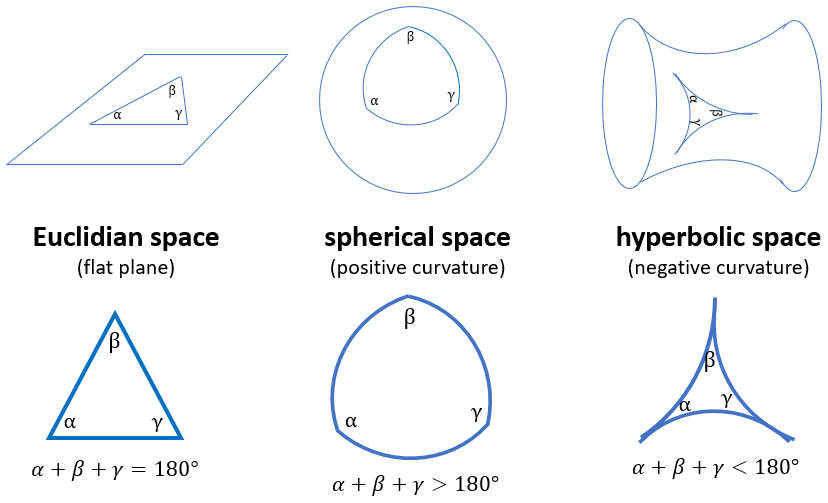
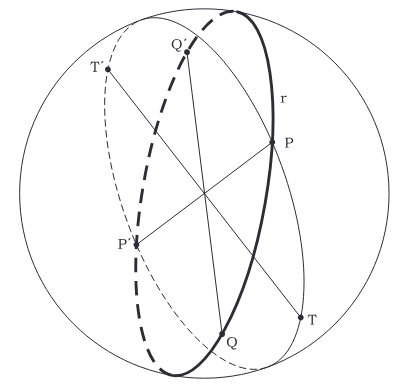

# Introduction to Galaxies and Astrophysics - Notes

### Note generali

Universo in espansione accelerata:
- isotropo
- omogeneo (Dalla legge di Copernico -> non siamo osservatori privilegiati)

3 pilastri che descrivono la fisica cosmologica:
- materia oscura
- energia oscura
- infrazione

### Exam

**Solo orale** (30 - 40 min)
- primo argomento a scelta (10 min)
- dopo domande a scelta del prof (su tutto il programma)

### First Lecture

La teoria che andremo a vedere è una *teoria geometrica*:

5 postulati di euclide:

1. per due $A$ e $B$ punti passa una ed una sola retta
2. Ogni segmento può essere prolungato indefinitamente secondo una retta
3. Dato un punto $O$ chiamato e un raggio $R$ esiste uno ed un solo cerchio centrato in $O$ con raggio $R$
4. Tutti gli angoli retti sono congruenti tra loro
5. Data una retta $R$ e un punto $P$ esterno ad $R$, esiste una ed una sola retta passante per $P$ e parallela a $R$

Il quinto postulato è più complesso degli altri, nel tempo i matematici hanno provato diverse volte a dimostrare il 5° postulato in funzione degli altri quattro.
Si è scoperto poi che il 5° fosse indipendente dagli altri.

1. Non esiste nessuna retta parallela ad R passante per P $\quad \Rarr \quad$ **Geometrie ellittiche piane $[S^2]$**

2. esistono 2 o più rette parallele ad R passanti per P $\quad \Rarr \quad$ **Geometrie iperboliche piane $[H^2]$**

    

#### Geometrie Ellittiche piane

La geometria ellittica piana è una forma di geometria non euclidea che rifiuta il quinto postulato di Euclide, il quale in geometria euclidea garantisce l'esistenza di una sola retta parallela passante per un dato punto. In geometria ellittica, non esistono rette parallele; invece, ogni coppia di rette si interseca eventualmente.

Un classico esempio è la **geometria sferica**, in cui le “rette” sono rappresentate da grandi cerchi su una sfera.

    

In questo contesto, i triangoli, noti come triangoli sferici, mostrano una proprietà intrigante: la somma dei loro angoli interni supera i 180° (un fenomeno noto come eccesso sferico), con l'eccesso proporzionale all'area del triangolo.

$$
\alpha + \beta + \gamma > 180
\\
S = R^2 (\alpha + \beta + \gamma)
$$

    

**Teorema di Descartes**

